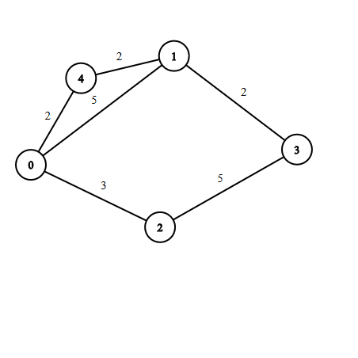

```
start  = 0
target = 3

h(0) = 7
h(1) = 0
h(2) = 5
h(4) = 4
```

```
g(0) = 0, f(0) = 7 - open
expand 0
g(1) = 5, f(1) = 5 - open
g(2) = 3, f(2) = 8 - open
g(4) = 2, f(4) = 6 - open
close 0

expand 1
g(3) = 5 + 2 = 7, f(3) = 7 - open
g(0) = 0 - no change
g(4) = 2 - no change
close 1

expand 4
g(0) = 0 - no change
g(1) = 4, f(1) = 4 - reopen 1 (!)
close 4

expand 1
g(4) = 2 - no change
g(0) = 0 - no change
g(3) = 6, f(3) = 6 - update 3
close 1

expand 3
target reached!
```